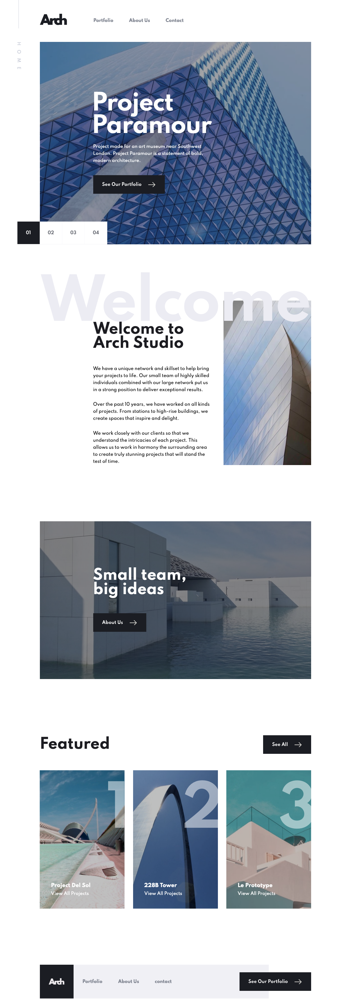

# Frontend Mentor - Arch Studio multi-page website solution

This is a solution to the [Arch Studio multi-page website challenge on Frontend Mentor](https://www.frontendmentor.io/challenges/arch-studio-multipage-website-wNIbOFYR6). Frontend Mentor challenges help you improve your coding skills by building realistic projects.

## Table of contents

- [Overview](#overview)
  - [The challenge](#the-challenge)
  - [Screenshot](#screenshot)
  - [Links](#links)
- [My process](#my-process)
  - [Built with](#built-with)
  - [What I learned](#what-i-learned)
  - [Continued development](#continued-development)
  - [Useful resources](#useful-resources)
- [Author](#author)


## Overview
This project was to transform the Arch Studio multi-page website into css and html code.

I found this project to be challenging for a number of reasons:
- The slider for mobile needed to work with touch actions
- The slider needed to loop so that it would give the user a good experience
- The way the layout shifted between desktop and mobile
- How to keep the code as simple and maintainable while still being flexible
### The challenge

Users should be able to:

- View the optimal layout for each page depending on their device's screen size
- See hover states for all interactive elements throughout the site
- Receive an error message when the contact form is submitted if:
  - The `Name`, `Email` or `Message` fields are empty should show "Can't be empty"
  - The `Email` is not formatted correctly should show "Please use a valid email address"
- **Bonus**: View actual locations on the contact page map. The addresses we have on the design are fictional, so you'll need to add real addresses for this bonus task.

### Screenshot


### Links

- Solution URL: [Github for Solution](https://github.com/helphop/FEM-ARCH)
- Live Site URL: [Live Site](https://frm-arch-fem.vercel.app)

## My process
I use trello to organize my work.  I find it helps to have a list of what I need to do and what I'm working on so that if I am away from the project for a few days I can see where I left off and what still needs to be done.

I examine the entire site in Sketch looking for any reusable elements that may become a component.  I take note of these elements in trello.

Then I examine the style guide and use it to setup my project in the Codyhouse Framework. They have a fantastic interface to set your spacing, typography, forms, buttons and a lot of excellent utilities.  The files they create are very small and the codebase is very well organized.  This gives me a good base from which to build.  The utilities really speed development and with everything organized into different scss files such as colors, forms, breakpoints, spacing etc its easy to find your way around.

I download the codyhouse framework that I created to my local machine.
Then I create a git repository and make my first commit.

I start with the index page and code the html for the entire page. I don't touch the css until I have completed the HTML. Its ok that the HTML will most likely change as needed, I like to have a complete HTML document to start.  I also ignore some elements to begin with  such as the vertical content on the desktop and tablet sizes as I like to focus on the main areas of content first such as navigation, footer since they are used on all pages.

I also examine how the layout changes with screen size.  For example the index slides are full width on mobile but have some padding on larger screens.  But the content inside the slide has the same padding as the other sections on mobile that are not full width. Then I do a lot of trial and error to find the best solution.

I work down the file starting from the navigation to the header hero sections and then the main body.  I always code the css for mobile first as those layouts are the simplest.  It also helps me to determine where elements should be placed in the HTML.  For example on the index page in the featured section, the See All button on tablet and desktop is at the top of the images. But on mobile it is shown under the images.  Therefore I make sure that I code the HTML with the button placed after the images.

The JavaScript I do after I have the layout working.  I create separate files for each component that I am working with i.e. _slider.js, _form.js etc.  The Codyhouse framework compiles these files into one JS file automatically.

After I have a page working fully I refactor.  I look at better ways to make the layout always working from a branch on git so that if I really mess things up I can just go back.  This gives me a lot of confidence knowing that I can't make any big mistakes.

Once I think a page is as good as I can make it, and everything works I move onto the next page.  This usually goes faster as I have the nav and footer done.

Sometimes if I am stumped on how to do something I find taking a day off from looking at it helps me to realize a solution. In fact most of the time after I've completed a site when I come back after a few days I realize so many ways I can improve the code.

Details I also include in my refactoring.  I look at the spacing, the color of the images, the alignment etc. This project had a lot of small details that were really challenging.
For example most of the images needed a filter to darken them so the text on top of them could be read.

### Built with
- Semantic HTML5 markup
- CSS custom properties
- CSS Flexbox
- CSS Grid
- Mobile-first workflow
- Codyhouse Framework
- ES6 JavaScript


### What I learned
On the about page's featured section I used a grid.  I wanted to use grid's ability to place elements one on top of the other for the mouse over effect that shows the social icons over the images.
I'm sure this could have been done using absolute position but I thought I would see how I could employ the power of the grid.
I really like the way it works.

```scss
   .card {
      display: grid; //use grid to position grid items on top of each other
      gap: var(--space-xxs);
      h3 {margin-top: var(--space-md);}
      &__role {color: alpha(var(--color-primary), 0.75);}

      .social {
         > :first-child {margin-right: var(--space-lg);}
         img {width: 2rem;}
      }
   }

 @include breakpoint(md) {
      .card {
         &__img {
            grid-row: 1; //<- position the image explicitly
            grid-column: 1; //<- position the image explicitly
            transition: all 0.4s;
         }
         .social {
            grid-row: 1; //<- position the image explicitly and because it is lower in the html it will appear on top of the image
            grid-column: 1; // <- position the image explicitly and because it is lower in the html it will appear on top of the image
            transition: all 0.2s;
            opacity: 0;
            display: flex;
            align-items: center;
            justify-content: center;
            img {
               transition: all 0.2s;
               width: 2.5rem;
               filter: invert(100%) sepia(96%) saturate(15%) hue-rotate(212deg) brightness(104%) contrast(104%);
            }
         }
         .social:hover {
            opacity: 1;
            background-color: alpha(var(--color-primary), 0.5);
            img:hover {
               filter: invert(61%) sepia(45%) saturate(1463%) hue-rotate(343deg) brightness(102%) contrast(92%);
            }
         }
      }
   }
```

The coding of the slides was really difficult.  I had to dive deep into how the grid works and the grid container.
I have created a sort of plugin that works as long as the html elements are present.

```js
const carousel = document.querySelector('.carousel');

if (elementExists(carousel)) {
  const slideNav = document.querySelector('.slide-nav');
  const slider = document.querySelector('.slider');
  const carouselWidth = carousel.offsetWidth;
  const numSlides = slider.childElementCount;
  let loopTimes = 0;
  let touchstartX = 0;
  let touchendX = 0;
  let translateAmount = 100/numSlides; //how far to move the slides
  let direction = 'left'; //set initial direction
  let currentSlide = document.getElementById('slide1'); //set initial slide

  //setup the carousel and slider
  carousel.style.cssText = `
                          width:100%;
                          height: 100%;
                          display: grid;
                          grid-template: 1fr / 100%;
                          justify-items: start;
                          overflow: hidden;
                          `;

  slider.style.cssText = `
                        height: 100%;
                        width: ${numSlides * 100}%;
                        display: grid;
                        grid-template-columns: repeat(${numSlides}, ${1/numSlides}fr);
                        transition: all 0.5s;
                        `;


  //FUNCTIONS -----------------------------------------------------------------------------------

  //set the current button to match the current slide
  //when resize from mobile screen size to desktop
  function resetCarousel() {
    if (slider.offsetWidth > 3158) setCurrentButton(getButtonForSlide(currentSlide.id));
  }

  function setCurrentButton(button) {
    document.querySelector('.btn--number--current').classList.remove('btn--number--current');
    button.classList.add('btn--number--current');
  }

  function getButtonForSlide(id) {
    return document.querySelector(`[data-slide="${id}"]`);
  }

  function handleGesture() {
    //swiped to the left
    if (touchendX < touchstartX) {
      slideleft();
    }
    //swiped to the right
    else if (touchendX > touchstartX) {
      slideright();
    }
  }

  function slideleft() {
    if (direction === 'right') {
      //must move the last slide to the start and shift the carousel to the end of the row.
      slider.prepend(slider.lastElementChild);
      //move the carousel to the start of the row
      carousel.style.justifyItems = 'start';
    }
    //set the direction we are now moving
    direction = 'left';
    //move the slider to the left
    slider.style.transform = `translateX(-${translateAmount}%)`;
  }

  function slideright() {
    //check if the previous slide was to the left
    if (direction === 'left') {
      slider.appendChild(slider.firstElementChild);
      //move the carousel to the end of the row
      carousel.style.justifyItems = 'end';
    }
    direction = 'right';
    slider.style.transform = `translateX(${translateAmount}%)`;
  }

  function setCurrentSlide() {
    for (let i = 0; i < numSlides; i++) {
      if (isInViewport(slider.children[i], carousel)) {
        currentSlide = slider.children[i];
        break;
      }
    }
  }

  function loopSlides(direction) {
      if (loopTimes > 1) {
      eval(`slide${direction}()`);
      loopTimes--;
    }
  }


  //EVENT LISTENERS-------------------------------------------------------------------

  //listen for slide button clicks
  slideNav.addEventListener('click', (event) => {

    button = event.target;
    buttonId = lastChar(button.getAttribute('data-slide'));
    slideId = lastChar(currentSlide.id);

    //determines the direction to move the slider
    slideAmount = parseInt(slideId) - parseInt(buttonId);

    //determines the number of times the slider must move
    loopTimes = Math.abs(slideAmount)

    if (slideAmount < 0) {
      slideleft();
    } else if (slideAmount > 0){
      slideright();
    }

    //change the color of the clicked button
    setCurrentButton(button);
  })

  //listen for finger gesture start
  slider.addEventListener('touchstart', e => {
    console.log('touched')
    touchstartX = e.changedTouches[0].screenX;
  });

  //listen for finger gesture end
  slider.addEventListener('touchend', e => {
    touchendX = e.changedTouches[0].screenX;
    handleGesture();
  });

  //listen for when the slide has finished moving
  slider.addEventListener('transitionend', function(e) {
    //check that it is the transform that has been fired not the button background color or other property
    if (e.propertyName === "transform") {
      //makes the slider seem infinite
      if (direction === 'right') {
        //move the last element to the start
        slider.prepend(slider.lastElementChild);
      } else {
        //move the first element to the end
        slider.appendChild(slider.firstElementChild);
      }

      //stops animating when the transition is put back to 0
      slider.style.transition = 'none';
      //reset the slider element to the starting position
      slider.style.transform = 'translate(0)';
      //set the slide that is now showing in the viewport
      setCurrentSlide();

      //delay the setting of the transition and calling the slide function when sliding more than 1 slide
      setTimeout(() => {
        //add back the animation of the slider
        slider.style.transition = 'all 0.5s';
        //loop moving the slider to get requested slide.  Works when buttons are clicked.
        loopSlides(direction)
      })
    }
  }, false);

  window.addEventListener("resize",debounce(resetCarousel));

}

```

For the slide I decided to put the images in the html and not use background images.  The reason for this is that I figured over time this company would add more projects and most likely the information used for the slides would be kept in a database. So by keeping the images in the HTML it makes it really easy to add another slide without touching the css or Js.
I used a srcset to the browser will decide which image to display.

```html
  <div class="slide" id="slide1">
    
    <div class="slide__content">
      <h1>Project <br> Paramour</h1>
      <p>Project made for an art museum near Southwest London. Project Paramour is
      a statement of bold, modern architecture.</p>
      <a href="portfolio.html" class="btn btn--primary--dark">See Our Portfolio</a>
    </div>
  </div>
```
### Continued development

I am currently enrolled in Kevin Powell's Flexbox Simplified course.  I am still working to get  comfortable with flexbox and would like to use it more to simplify my code.  I also am taking a course called JustJavascript to gain a deeper understanding of how it works so that I can code better. As always I find it a challenge to work from design to html and css.  There are so many ways to code a layout but some that are really easy to maintain. That is where I want to improve, to be able to look at a design and have the know how to see what I have to do.

### Useful resources

- [codyhouse framework](https://codyhouse.co/) - This helped me to set the buttons typography spacing utilitiesand organize the files. A great framework to start from.
- [Stackoverflow ](https://stackoverflow.com/) - Very helpful when I need a solution to a problem. I'm here often. Very often.  Ok I live here.
- [Css Tricks ](https://css-tricks.com/) - Amazing resource for all kinds of css stuff.


## Author
- Frontend Mentor - [@helphop](https://www.frontendmentor.io/profile/helphop)


